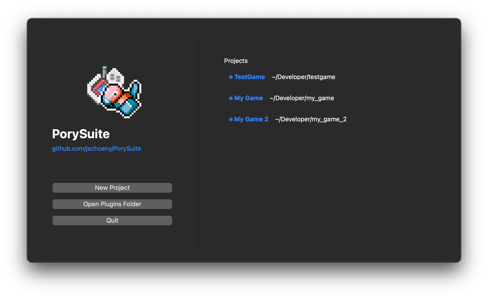
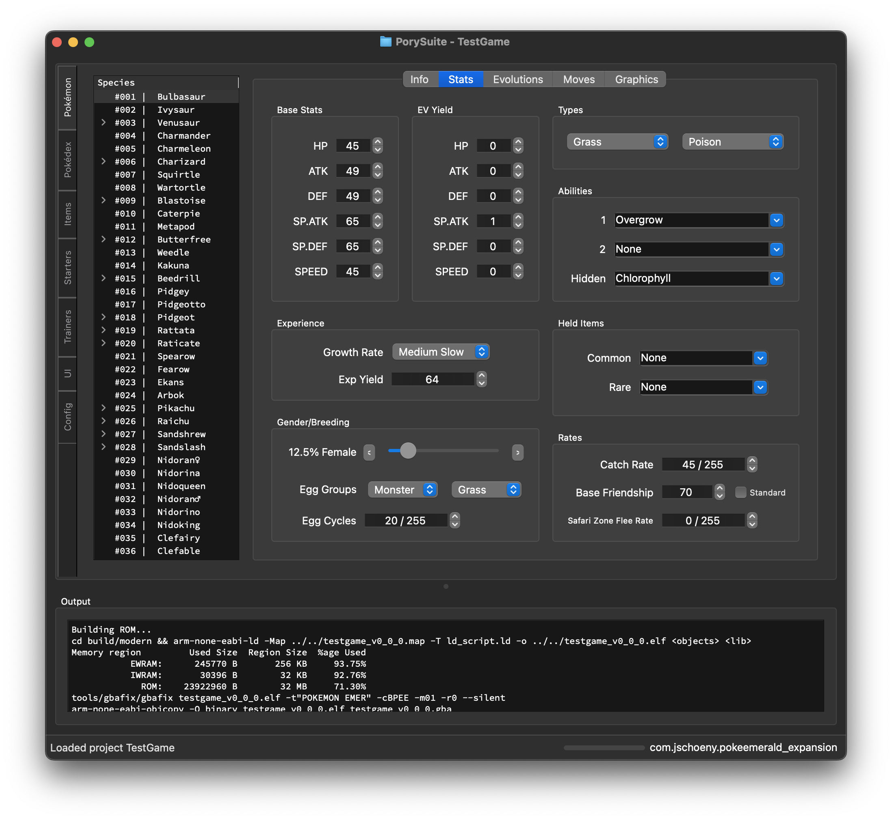

# PorySuite
An extensible toolkit for Pokémon decomp projects.

**NOTE: This project is still in alpha. It is not a finished product and will not always behave as expected. _Not all data will be modifiable in the UI._**

One of the biggest roadblocks for first-time ROM hackers wanting to use the decomps ([pokeemerald](https://github.com/pret/pokeemerald), [pokeemerald-expansion](https://github.com/rh-hideout/pokeemerald-expansion), [pokefirered](https://github.com/pret/pokefirered), [pokeruby](https://github.com/pret/pokeruby)) is the initial setup process.

_See pokeemerald's [INSTALL.md](https://github.com/pret/pokeemerald/blob/master/INSTALL.md) to see why it can be a bit daunting._

PorySuite aims to make this process as easy as possible by providing a single tool that can handle all of that setup for you by integrating with [Docker](https://www.docker.com/products/docker-desktop/).

This program also aims to provide a user-friendly interface for adding features and modifying data in the decomp projects.




## Contributing
Contributions are more than welcome! If you have an idea for a feature or a bug fix, feel free to open an issue or a pull request.

### Prerequisites
- [Docker Desktop](https://www.docker.com/products/docker-desktop/)
- [Python 3.12+](https://www.python.org/downloads/)

### Setup
1. Create Python virtual environment
2. Install dependencies
    ```bash
    pip install -r requirements.txt
    ```
3. Run the project
    ```bash
    python app.py
    ```

### Plugins
Plugins in PorySuite are used to choose which decomp repo you want to use. The plugin handles data extraction from and parsing to the source code.

Check out the built-in [Pokeemerald Expansion plugin](plugins/pokeemerald_expansion/) for an example of how a plugin should be implemented.

For development purposes, you can choose to only load plugins from the local source [plugins](plugins) folder:
```bash
python app.py debug
```

**NOTE: Because this project is still in alpha, not all data will be able to be modified in the UI.**
